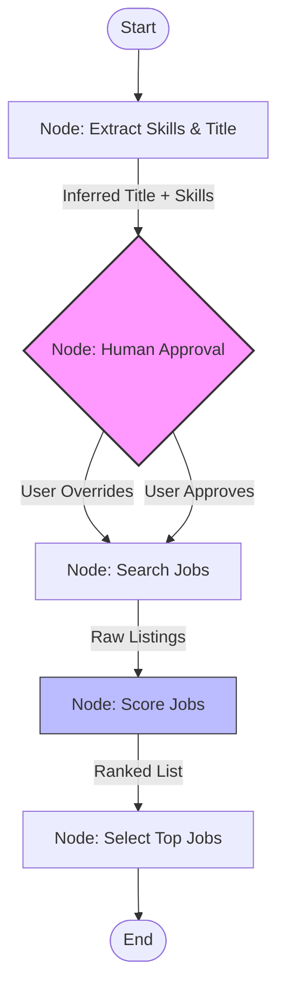

# AI Job Matcher Agent

The **Job Matcher Application** is an intelligent workflow designed to automate the job search process. By leveraging **LangGraph** and **GPT-4o-mini**, the system analyzes a candidate's CV, performs real-time searches on Google Jobs, and scores listings based on semantic relevance rather than simple keyword matching.

## 📖 Project Overview

Manual job searching is often inefficient and lacks context. This application solves that by using a **State Machine** architecture to:

1. **Analyze** your local vector resume data to infer your ideal job title.
2. **Verify** the search strategy with you (Human-in-the-Loop).
3. **Search** live listings via SerpApi.
4. **Score** every job from 0-100 based on your specific technical skills.

## Architecture

The application is built using **LangGraph**, treating the workflow as a graph of nodes where state is passed and mutated at every step.



### Component Breakdown

* **Extract Skills Node:** Queries a local `Chroma` database to retrieve CV segments and uses `gpt-4o-mini` to identify the candidate's core skills and best-fit job title.
* **Human Approval Node (HITL):** A blocking checkpoint that pauses execution, allowing the user to verify or edit the search query via the console.
* **Search Jobs Node:** Utilizes `SerpApi` (Google Jobs engine) to fetch the top 10 live job listings.
* **Score Jobs Node:** Acts as an "AI Recruiter," assigning a confidence score (0-100) and a reasoning sentence to every job found.

## 🛠️ Prerequisites & Setup

### 1. Environment Variables

You must create a `.env` file in the root directory with the following keys:

```bash
OPENAI_API_KEY=sk-...
SERP_API=...

```

### 2. Dependencies

The system relies on Python 3.12+ and the following libraries:

* `langgraph`
* `langchain` & `langchain-openai`
* `langchain-chroma` & `langchain-huggingface`
* `google-search-results` (SerpApi)
* `python-dotenv`

### 3. Database Configuration

**Note:** The script currently points to a hardcoded local ChromaDB path. You must update the `DB_PATH` constant in `job_matcher.py` to point to your local vector store:

```python
DB_PATH = "/path/to/your/chroma_db"

```

## Usage

Run the main script to initiate the agent workflow:

```bash
python job_matcher.py

```

### Runtime Interaction

1. The agent will print the **Inferred Job Title** and a summary of **Extracted Skills**.
2. It will pause and wait for your input:
* **Press Enter:** Accepts the AI's suggestion.
* **Type a new title:** Overrides the search query.


3. The agent will then search, score, and output the **Top 3 Jobs** with reasons for why they match your profile.

## Project Structure

* **`job_matcher.py`**: The main entry point containing the LangGraph definition, node logic, and helper functions.
* **`requirements_doc.md`**: Detailed functional and non-functional requirements.
* **`Tech_Doc.md`**: Technical walkthrough and code explanation.

## ⚠️ Notes

* **Tokenizers:** The script explicitly disables tokenizer parallelism (`TOKENIZERS_PARALLELISM="false"`) to prevent deadlock issues common when using HuggingFace embeddings on macOS.
* **Model:** The system maps the internal request `gpt-4.1-mini` to the actual OpenAI model `gpt-4o-mini`.
