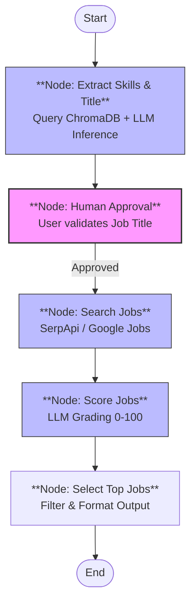

# Job Matcher Code Walkthrough

**Target File:** `job_matcher.py`
**Framework:** LangGraph / LangChain

## 1. Overview
The `job_matcher.py` script implements an intelligent agent workflow designed to match a candidate's profile with live job listings. It moves beyond simple keyword matching by using LLM-based semantic analysis for both query formulation and result scoring.

## 2. Architecture & Flow Diagram

The application uses **LangGraph** to model the workflow as a state machine.



## 3. Code Breakdown

### 3.1. State Definition
We define a global state object `JobState` that persists data as it moves between nodes.
```python
class JobState(TypedDict):
    job_title: str          # The search query (e.g. "AI Engineer")
    skills: str             # Summary of technical skills for scoring
    job_listings: List[Dict]# Raw results from Google Search
    scored_jobs: List[Dict] # Results with added 'match_score' and 'reason'
    final_output: str       # Formatted string for display
```

### 3.2. Nodes Implementation

#### A. Extract Skills Node (`extract_skills_node`)
*   **Function**: Queries the local ChromaDB for the candidate's CV segments.
*   **Intelligence**: Sends the CV text to `gpt-4o-mini` with a prompt to:
    1.  Infer the best **Job Title**.
    2.  Summarize **Key Skills**.
*   **Importance**: This ensures the search is grounded in the candidate's actual data, not just hardcoded strings.

#### B. Human Approval Node (`approval_node`)
*   **Function**: Intercepts the workflow before the external search.
*   **Interaction**: Displays the inferred title and pauses for keyboard input.
*   **Logic**:
    *   If user presses `Enter` -> Keep inferred title.
    *   If user types text -> Overrides the title.

#### C. Search Jobs Node (`search_jobs_node`)
*   **Function**: Executes the search against the Google Jobs engine.
*   **Tool**: Uses `serpapi.GoogleSearch` via a helper function `find_jobs`.
*   **Constraint**: Fetches the top 10 results to keep the context window manageable for the next step.

#### D. Score Jobs Node (`score_jobs_node`)
*   **Function**: acting as a "Recruiter Agent".
*   **Process**: Iterates through every job found.
*   **Prompting**: Asks the LLM to score the job (0-100) based on the specific `job_title` and `skills` extracted earlier.
*   **Reasoning**: Requires the LLM to provide a one-sentence justification for the score.

#### E. Select Top Jobs Node (`select_top_jobs_node`)
*   **Function**: Aggregation and Formatting.
*   **Logic**: Sorts the list by `match_score` descending and takes the top 3.
*   **Output**: Prints a clean, readable Markdown-style summary to the console.

### 4. Key Libraries Used
*   **`langgraph`**: For managing the state machine and workflow edges.
*   **`langchain_openai`**: For interacting with the GPT-4o-mini model.
*   **`langchain_chroma`**: For vectorized database operations.
*   **`serpapi`**: For accessing real-time Google Search results.

### 5. Configuration & Setup
*   **Environment Variables**: Requires `SERP_API` and `OPENAI_API_KEY` in `.env`.
*   **Tokenizers**: Parallelism is explicitly disabled (`os.environ["TOKENIZERS_PARALLELISM"] = "false"`) to prevent threading deadlocks common in macOS environments when using HuggingFace tokenizers alongside multiprocessing.
